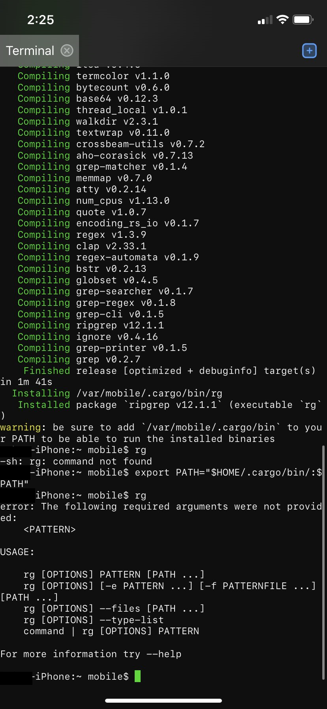

### 关于 Rust 标准库的管理重组

【来自 Rust 官博的博文】 Rust 项目是一个大型和多样化的项目，它的活动基本上是由团队来协调的。官方正在尝试对 Libs 团队和 Compiler 团队之间的标准库活动进行重组。在将来，Libs 团队将仅管理标准库的公共 API，而 Compiler 团队将只关心其实现。分离关注点的目的是为了更好地适合两个团队的利益，以更好地支持标准库的需求。更多详情请看原文：https://blog.rust-lang.org/inside-rust/2020/07/02/Ownership-Std-Implementation.html

### Rust 编译器团队 2020-2021 roadmap

详情请看：https://rust-lang.github.io/compiler-team/minutes/design-meeting/2020-05-29-Roadmap-2020-2021/

### 在 iPhone 11 上原生运行 cargo 和 rustc

相关 Rust-lang PR：https://github.com/rust-lang/rust/pull/73903

reddit上参与讨论：https://www.reddit.com/r/rust/comments/hjk4vw/cargo_and_rustc_running_natively_on_an_iphone_11/

### `dua-cli`

`dua`(->磁盘使用分析器)使用 Rust 实现，可以方便地了解给定目录的磁盘空间使用情况。

项目地址：https://github.com/byron/dua-cli

---

From 日报小组 @Jancd

社区学习交流平台订阅：

- [Rustcc论坛: 支持rss](https://rustcc.cn/)
- [微信公众号：Rust语言中文社区](https://rustcc.cn/article?id=ed7c9379-d681-47cb-9532-0db97d883f62)
