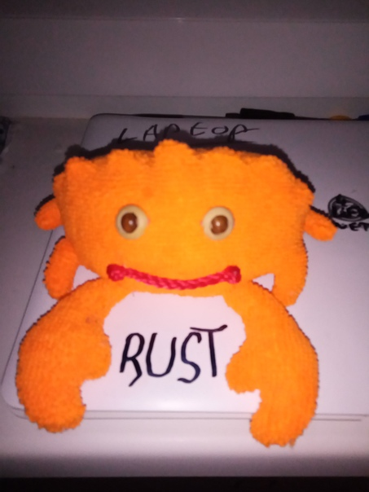

### Google - XLS 加速硬件合成


什么是XLS？XLS（加速硬件合成）项目旨在实现硬件 IP 的快速开发，该硬件 IP 还可通过“软件样式”方法作为有效的主机软件运行。

XLS 实施了高级综合（HLS）工具链，该工具链根据灵活的高级功能描述生成可综合的设计。它在 GitHub 上完全开源的并使用 Apache 2 开源协议。

XLS 在 Google 内部用于从“构建块”例程/库生成前馈管道，这些例程/库可以轻松地重新定向，重用和以对延迟不敏感的方式进行组合。

目前尚不可用，但正在进行的工作是通信顺序过程（CSP）样式的 XLS 并发过程的实现，该过程允许管道彼此通信并随着时间的推移进行引入。

[仓库地址](https://github.com/google/xls)：https://github.com/google/xls

### 裸机的 Rust 泛型

作者有机会在专业环境下参与 Rust STM32F412 项目，目标之一是在公司孵化一个 Rust 知识库。该项目，Loadstone，是一个32kb的安全引导装载程序，针对裸金属设备的医疗行业。在此背景下，作者对 Rust 的裸金属泛型进行分享。

[原文链接](https://www.ecorax.net/as-above-so-below-1/):https://www.ecorax.net/as-above-so-below-1/

### 异步的 Rust HTTP 状态码

### Fontdue 项目

Fontdue是一个简单的、no_std(不使用标准库来实现可移植性)、纯 Rust、TrueType (.ttf/.ttc)和 OpenType (.otf) 字体光栅化和布局工具。它努力使与字体的交互尽可能快，并且目前拥有最快的光栅化器。 

使用示例:

```rust
// Read the font data.
let font = include_bytes!("../resources/Roboto-Regular.ttf") as &[u8];
// Parse it into the font type.
let font = fontdue::Font::from_bytes(font, fontdue::FontSettings::default()).unwrap();
// Rasterize and get the layout metrics for the letter 'g' at 17px.
let (metrics, bitmap) = font.rasterize('g', 17.0);
```

[项目地址](https://github.com/mooman219/fontdue/)：https://github.com/mooman219/fontdue/

### Just made my own little Ferris :)



---

From 日报小组 @Jancd @Downtime

社区学习交流平台订阅：
- [Rust.cc论坛: 支持rss](https://rust.cc)
- [微信公众号：Rust语言学习交流](https://rust.cc/article?id=ed7c9379-d681-47cb-9532-0db97d883f62)
